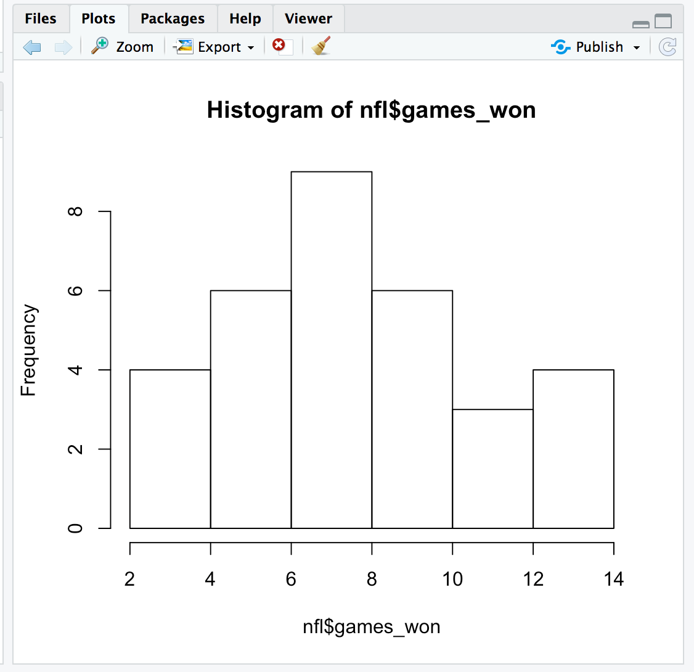

### GETTING STARTED

First, set your working directory. 
setwd("FILE PATH HERE")

```setwd("~/IRE_NICAR/NOLA_2020")```

Or you can use the drop-down menu: Session -> Set Working Directory -> Choose Directory

Make sure these four packages are installed and loaded: dplyr, tidyverse, ggplot2 and psych
install.packages("package_name")
library(package_name)

```
library(dplyr)
library(tidyverse)
library(ggplot2)
library(psych)
```

We'll work with three data sets:
- nba.csv -- NBA player stats
- nfl.csv -- NFL team stats
- txmiddle.csv -- Test scores for Texas middle schools 

Bring the .csv files into R. They all have field names, so we include this: col_names = TRUE
newfilename <- read_csv('csv file name', col_names = TRUE)
```
nba <- read_csv('nba.csv', col_names = TRUE)
nfl <- read_csv('nfl.csv', col_names = TRUE)
txschools <- read_csv('txmiddle.csv', col_names = TRUE)
```
Tip: Avoid column names that contain spaces. Go with 'field_name' not 'field name'

Let's start with the NBA file. To see how a file is structured, type
str(filename)
```
str(nba)
```
We have 509 cases and six variables.
The first two fields - player and team - are characters, while the other four are numeric.

### DESCRIPTIVES: MIN, MAX, AVERAGE, ETC.
Let's get some basic statistics from our data - averages, standard deviations, etc. 
The 'psych' package we loaded has a handy function called 'describe'. 
describe(filename)
```
describe(nba)
```
The first two fields are strings, so R can't run statistics on them.

But check out the last four. The average age of NBA players, for instance, is 25-1/2. They range from 19 to 43 years old.
The sd (standard deviation) of 4 means about two-thirds of players fall within 4 years of the average age.
That is, about two-third of players range from 21-1/2 to 29-1/2 years old.

You can also get a single statistic for a single variable.
measure(filename$fieldname)
```
mean(nba$height)
```
The average height for players is 78.3 inches. What about the heaviest player?
```
max(nba$weight)
```
Uh oh, we get "NA" because a couple of players have missing values. In that case, we tell R to remove the NAs by adding 'na.rm = TRUE'
```
max(nba$weight, na.rm = TRUE)
```
The heaviest player weights 311 pounds.

### MAKE COMPARISONS: Z-scores

Sometimes we want to compare things on the same scale. 
For instance, Tacko Fall is the tallest AND heaviest player in our data.
But is he taller than he is heavy? 

That's where Z-scores come in. Z-scores tell you how far from the average a certain data point - or NBA player - is.
It's expressed as a standard deviation.

Calculate the Z-score for one variable
scale(filename$fieldname)
```
scale(nba$height)
```
Tacko Fall is row 445 in our data. His Z-score, or standardized score, is 3.02. 
That means his height is 3.02 standard deviations above the average height of 78.3 inches. 
Now get his standardized weight.
```
scale(nba$weight)
```
Tacko's weight is 3.88 standard deviations above the average weight of 217.3 pounds.
So he's heavier (3.88) than he is tall (3.02)

What if you want Z-scores for all variables? scale() works only on numeric data.

In our files, that's columns 3 through 6. Put that range in brackets, like so:
```
scale(nba[3:6])
```
This time we don't see all cases. Let's save this as a new file (or dataframe in R speak)
```
znba <- scale(nba[3:6])
```
Let's combine those Z-scores with our original file so we have everything together.
Use a function called cbind, for column bind.

newfile <- cbind(file1, file2)
```
nba_joined <- cbind(nba, znba)

View(nba_joined)
```
### FIND RELATIONSHIPS: Correlations

Let's switch to the NFL file and run some correlations.
```
View(nfl)
```
Look at the relationship between the number of points scored and games won all season.

cor(filename$fieldname1, filename$fieldname2)
```
cor(nfl$pts_scored, nfl$games_won)
```
The correlation is 0.71. What does that mean?

Correlations range from -1 to 1.
- A value of -1 means perfect negative correlation. As one variable goes up, the other goes down.
- A value of 1 means perfect positive correlation. The two variables go up together.
- A value of 0 means no correlation - there's no relationship between the two variables.

So 0.71 shows a strong correlation between points scored and games won.
Note: This correlation is also known as Pearson's R. It's the default kind with cor()
What if we want to see correlations for all pairs of variables?
Remember to select only numeric fields, in this case colums 2 through 9.
```
cor(nfl[2:9])
```
The strongest correlation is between points scored and yards gained, at 0.84.
The weakest is between takeaways and yards gained, at 0.03.

We also want to know if the correlations are significant - did they happen by pure chance?
The corr.test function from the psych package shows this. Again, it works only on numeric fields.
```
corr.test(nfl[2:9])
```
We see the correlations again, followed by probability values, also known as p-values.
Anything less than 0.05 means it's statistically significant.
That means there's less than 5 percent probability that we got these results by pure chance.

Take the mild correlation of 0.37 between takeaways and points scored. It has a p-value of 0.62.
That means there's a 62 percent chance we got those results by dumb luck.

### VISUALIZE YOUR DATA: Histograms and scatter plots

It helps to visualize your data, too. For one variable, draw a histogram.

hist(filename$fieldname)
```
hist(nfl$games_won)
```


For two variables, make a scatter plot.

plot(filename$fieldname1, filename$fieldname2)
```
plot(nfl$games_won, nfl$pts_scored)
```
You can also draw plots of all pairs of variables. Once again, R takes only numeric variables.
For the NFL data, that's columns 2 through 9.
```
pairs(nfl[2:9])
```
What if you want to show three pairs of variables that aren't in order? Here's the syntax.
pairs(~ fieldname2 + fieldname4 + fieldname6, data = filename )
```
pairs(~ pts_scored + giveaways + yds_allowed, data = nfl)
```
### MAKING PREDICTIONS: Regression

Regression shows how strongly two or more variables are related.
You can also make predictions based on that relationship.

Let's work with the txschools file.
```
View(txschools)
```
It shows student test scores and demographics for Dallas-area middle schools. 

Let's run basic statistics first.
```
describe(txschools)
```
Or, to show only the numeric columns
```
describe(txschools[7:13])
```
Let's look at the various correlations.
```
cor(txschools[7:13])
```
And see if they're statistically significant.
```
corr.test(txschools[7:13])
```
Note that except for the number of students, all the other correlations are significant.

Let's draw some histograms and scatter plots, too.
```
hist(txschools$math_meets)
hist(txschools$low_income)
plot(txschools$low_income, txschools$math_meets)
plot(txschools$low_income, txschools$read_meets)
```
Let's focus on read_meets, the percentage of students passing the state reading test.
There's a strong correlation of -0.88 between a school's reading pass rates and its share of low-income kids.

We will run a linear model (lm) regression. It's linear because the relationship follows a straight line.
lm(dependent_variable ~ independent_variable, data=filename)
You'll see Y for the dependent variable and X for the independent variable, like:
lm(Y ~ X, data=filename)

In this case, the reading score is the dependent variable because we think that the score depends on the percent of low-income kids. 
```
lm(read_meets ~ low_income, data=txschools)
```
We get two coefficients the Intercept is 82.2 and low_income is -0.56.
We'll come back to that in a minute. First, let's run the same regression but save it as a dataframe 
Let's call it read_model
```
read_model <- lm(read_meets ~ low_income, data=txschools)
summary(read_model)
```
Start with the Adjusted R-squared: 0.78

Remember the correlation - that is, the Pearson's R - between read_meets and low_income was 0.883?

Well, take that Pearson's R and square it. 0.883 x 0.883 = 0.78  That's the R-squared value.

What does the R-squared mean?

It means that 78% of the variation in reading scores is explained by the share of low-income kids.

Put another way, only 22% of the variation in reading scores is explained by other factors - teacher quality, class size, etc.

We know the R-squared is statistically significant because of the p-value that's well below 0.05.

Okay, we know that reading scores vary with the share of poor students. How big is that relationship?

Look at Coefficients, where it says -0.55955 for low_income.

That means that for every one-point increase in the percentage of low-income kids at a school, we expect their reading score to drop by 0.55 points.

Or, multiply it by 10: For every 10-percentage point increase in the poverty rate, we expect reading scores to drop 5.5 points.
